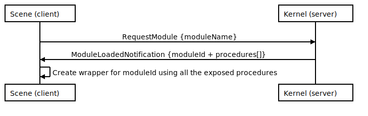
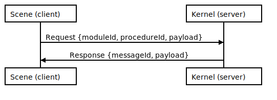
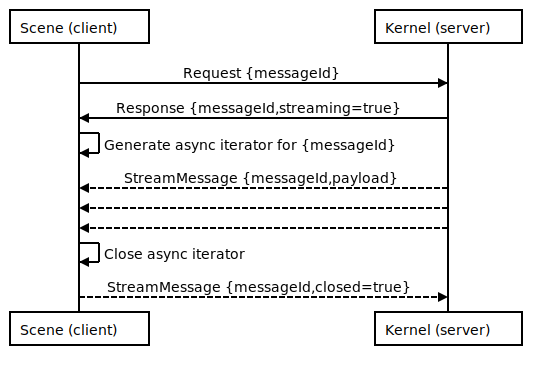

# @dcl/rpc

## Main engine of change

`decentraland-rpc` was the first repository we build to create the decentraland explorer (the game client and SDK).

It is probably the only thing that is left from that time, even though it passed the test of time very well we often make suboptimal decisions because the way it works.

It is time to start reconsidering what things we have been sacrificing, even without noticing, that may be of a greater value in the future 5 years of Decentraland.

This is a non-exhaustive list of considerations for this new protocol:

* Most of the time, it will be a in-memory transport, that is, communication between processes or threads. Not over a network wire.

* While we use an in-browser approach for the Explorer, browser optimizations must be taken into account

    * Transferable objects between Workers and Renderer threads, `SharedArrayBuffers` when possible.

    * Not serialize everything to JSON back-and-forth

    * Remove stacked layers, optimize function calls and object allocations

    * Copying slices of ArrayBuffers is heavily optimized in browsers

* Unity will only care about ArrayBuffers written to its memory, there will be no need to use JSON in the main threads

* We may want to run several scenes in the same worker, multiplexing should be part of the initial design.

* To maintain a healthy anti corruption layer (ACL), any kind of application should be capable on the RPC library. Not only the decentraland Explorer and scenes.

### Design requirements

* Notifications will evolve into streams, nowadays subscribing to an event is difficult to reason and hard to code

* RPC Definition may leverage GRPC code generation to document the protocol itself 

* Remote procedures must be initialized by requesting a module

* Module-based remote calls did prove themselves useful with time, to organize the remote calls we may continue using modules. Rename classes to modules.

### Notice

* Even though this document will be written using protocol buffers, the implementation may use a smaller and faster hand-made protocol for performance.

* Message payloads may or may not use protocol buffers

## Module loading
```protobuf
/////////////////////////////////////////////////////////////
////////////////////// Module loading ///////////////////////
/////////////////////////////////////////////////////////////

message RequestModule {
    fixed32 portId = 1; // used to multiplex transports
    fixed32 messageId = 2;
    string  moduleName = 3;
}

message ModuleLoadedNotification {
    // portId is used to multiplex transports
    fixed32 portId = 1; 
    fixed32 messageId = 2;
    string  moduleName = 3;
    fixed32 moduleId = 4;
    ModuleProcedure procedures = 5;

    message ModuleProcedure {
        fixed32 procedureId = 1;
        string  procedureName = 2;
        // we can possibly define some parameter information.
        // It is bot really necessary now.
    }
}
```

#### Start a RPC session and load a module to call a remote procedure

<!--
```sequence
participant Scene (client) as C
participant Kernel (server) as S
C-&gt;S: RequestModule {moduleName}
S-&gt;C: ModuleLoadedNotification {moduleId + procedures[]}
C-&gt;C: Create wrapper for moduleId using all the exposed procedures
```
-->


## RPC messages

The RPC communications resemble JSON-RPC, the main differences are:

- The `method` field is now called `procedureId` (and it is a number)

- `moduleId` was added

- `payload` can be anything (serialized)
```protobuf
/////////////////////////////////////////////////////////////
//////////////////////////// RPC ////////////////////////////
/////////////////////////////////////////////////////////////

message Request {
    fixed32 portId = 1;      // used to multiplex transports
    fixed32 messageId = 2;   // same semantics of JSON-RPC
    fixed32 moduleId = 3;    // module owner of the procedure
    fixed32 procedureId = 4; // id of the procedure to be called
    bytes   payload = 5;     // payload of the request (this protocol doesn't care about the content)
}

message Response {
    fixed32 portId = 1;      // used to multiplex transports
    fixed32 messageId = 2;   // same semantics of JSON-RPC

    oneof responses {
        ErrorObject error = 3; // an error object in case of failure
        bytes payload = 4;     // the payload in case of a successful result
        bool streaming = 5;    // true when the client should expect an asynchronous stream of notifications
    }
}

// StreamMessage are all the elements of a stream call. The intended use case
// is to generate subscriptions and event listeners from the client side. It is
// designed with async iterators in mind (think about js sagas).
message StreamMessage {
    fixed32 portId = 1;        // used to multiplex transports
    fixed32 messageId = 2;     // same semantics of JSON-RPC
    oneof {
        ErrorObject error = 3; // an error object in case of failure
        bytes payload = 4;     // the payload in case of a successful result
        bool  closed = 5;      // an empty message signaling the end of the stream
    }
}

message ErrorObject {
    fixed32 code = 1; // enum InvalidProcedure, ModuleNotLoaded, Exception
    string  errorMessage = 2;
}
```

#### Regular RPC call from Scene to Kernel

<!--
```sequence
participant Scene (client) as C
participant Kernel (server) as S
C-&gt;S: Request {moduleId, procedureId, payload}
S-&gt;C: Response {messageId, payload}
```
-->


#### Getting an async stream

<!--
```sequence
participant Scene (client) as C
participant Kernel (server) as S
C-&gt;S: Request {messageId}
S-&gt;C: Response {messageId,streaming=true}
C-&gt;C: Generate async iterator for {messageId}
S--&gt;C: StreamMessage {messageId,payload}
S--&gt;C:
S--&gt;C:
S--&gt;C: StreamMessage {messageId,closed=true}
C-&gt;C: Close async iterator
```
-->


#### Closing an async stream from the Scene

<!--
```sequence
participant Scene (client) as C
participant Kernel (server) as S
C-&gt;S: Request {messageId}
S-&gt;C: Response {messageId,streaming=true}
C-&gt;C: Generate async iterator for {messageId}
S--&gt;C: StreamMessage {messageId,payload}
S--&gt;C:
S--&gt;C:
C-&gt;C: Close async iterator
C--&gt;S: StreamMessage {messageId,closed=true}
```
-->


# Implementation of the interfaces

Nowadays the current RPC uses classes in the server side to keep track of the methods that can be called.

The classes are requested from the client using a similar mechanism as the previously defined, we now call them modules.

The classes used to implement a special interface in order to comply with the library, the semantics and the conventions of

those interfaces are hard to get while reading the code. The approach of this new library will be more

"verbosic" in order to allow the developers to understand what happens behind the curtain, and placing

them in control of the combinatorial semantics of the library.

## Simplest use case
```typescript
// cluster.worker.ts 

import {createRpcClientCluster} from '@dcl/rpc'

const cluster = createRpcClientCluster(WebWorkerTransport(self /* self==webWorker */))

// run 1..n scenes in a single worker
createRpcClient.onNewClient(async client => {
    const sceneInfoModule = await client.loadModule('SceneInfo')

    // get the data to load the scene
    const DATA = deserialize(await sceneInfoModule.getSceneInfo())

    runInSandbox(DATA.src, {
        async loadModule(moduleName: string) {
            return client.loadModule(moduleName)
        }
    })
})
```
```typescript
// kernel
import {createRpcServer} from '@dcl/rpc'

const transport = WebWorkerTransport(new Worker('cluster.worker.js'))

// create the kernel cluster
const kernel = createSceneKernel(transport)

// create a scene worker, set the data
const sceneWorker = kernel.createClusterWorker({
    DATA: {
        src: "bin/game.js"
    }
})

function createSceneKernel(transport) {
    // create the rpcServer
    const server = createRpcServer( )

    server.registerModule('SceneInfo', {
        // ================================================
        // Obtain the information of the scene
        // ================================================
        async getSceneInfo(sceneWorker): Uint8Array {
            return serialize(sceneWorker.DATA)
        }
    })

    server.registerModule('EngineModule', {
        // ================================================
        // Receive a message with batch commands to execute
        // ================================================
        async sendBatch(sceneWorker, payload: Uint8Array) {
            console.log("The server sends a batch of messages", payload)
        }
        
    })

    return server
}
```

## Advanced use cases
```typescript

server.registerModule('EngineModule', {
    // =====================================================================
    // Advanced use case: Subscribe to a tick, happens once every 16ms aprox
    // =====================================================================
    async * getTickStream(sceneWorker) {
        let i = 0

        while (true) {
            await sleep(16)
            if (yield i++) {
                // stop if the channel is closed
                break
            }
        }
    } 
})

server.registerModule('InputModule', {
    // ============================================
    // Advanced use case: Subscribe to input events
    // ============================================
    async * getInputEventStream(sceneWorker) {
        while (true) {
            // https://stackoverflow.com/questions/51045136/how-can-i-use-a-event-emitter-as-an-async-generator
            const asyncStream = new AsyncStream()

            const observer = inputEvents.on('input', event => {
                asyncStream.push(serialize(event))
            })

            for async (let event in asyncStream) {
                if (yield event) {
                    // stop if the channel is closed
                    break;
                }
            }

            // release the observer
            inputEvents.off(observer)
        }
    }
})
```

## Design considerations

1. The transport is the abstraction (represents the media layer)

2. Every packet has a `portId`, to route the message to its correspondent instances  (session layer, cluster management)

    1. Default cluster coordinator uses `portId = 0`

3. Every message sends a blob payload. Code may be generated to understand the blob (application layer)
